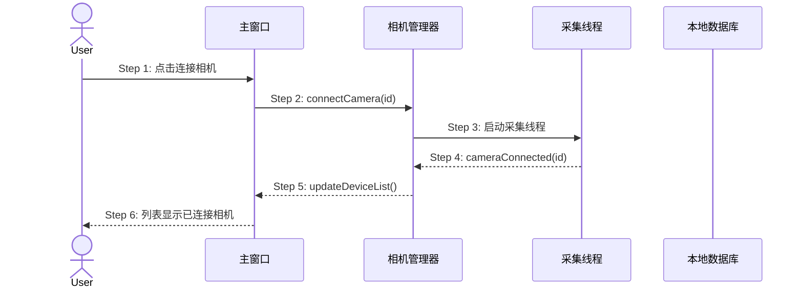

# Skill: Qt Scenario Architect

> Phase 03 · 场景建模：将 Phase 01/02 场景展开为**信号槽时序图**，标注线程上下文与异常分支，为 C++ 头文件契约提供追溯来源。

## 触发条件

- 用户要求画时序图、场景建模或信号槽流程设计
- 用户提到「Phase 03」「场景建模」
- 用户指定场景编号（如 S01）需展开技术时序

## 前置依赖

- `requirements.md`、产品设计文档、架构概要
- `qt-project.yaml` 中 `scenarios` 已确认

## 核心能力

1. 沿用 Phase 01 场景编号，不重新发明场景
2. 绘制 Mermaid 时序图（User、MainWindow、Manager、Worker、DB 等参与方）
3. 标注 Signal/Slot 调用与线程上下文
4. 设计 EX 异常用例（技术级）
5. 生成场景概览索引

## 执行步骤

### Step 0: 确认场景清单（强制）

读取 `qt-project.yaml` → `scenarios`：

- 不存在 → 结合需求/设计整理清单，用户确认后写入
- 已存在 → 展示清单，用户确认完整后再建模

### Step 1: 加载场景上下文

从需求、design-spec、架构文档提取：参与方、主路径、已知异常 AC。

**粒度检查**：单 API/单按钮场景 → 停止，建议回到 qt-prd-writer。

参与方命名与架构模块一致（如 `CameraMgr`、`Worker`）。

### Step 2: 绘制时序图

**Qt 信号槽时序图示例**：



**编号规范**：

- 每条箭头：`Step N:` 前缀，**单行书写**
- 参与方别名用短 ASCII（`MainWindow`、`Worker`），显示名可用中文
- 信号/槽细节、JSON、长错误体 → 放在时序图下方「步骤说明」

**Qt 特有标注**（步骤说明中）：

- 信号名与参数类型（`void frameReady(const QImage &)`）
- 线程：`(主线程)` / `(Worker 线程)`
- 对象生命周期（断开时 deleteLater、QPointer 防护）

### Step 3: 撰写步骤叙事

正常流程：逐步编号列表，主语粗体，与 Step N 一一对应。

异常引用：`→ 见 EX-N.M`，异常详情独立成章。

### Step 4: 设计异常用例

```markdown
### EX-3.1: 相机连接超时

- **触发条件**：Step 3 Worker 30 秒内未返回 cameraConnected
- **期望响应**：CameraMgr 发射 connectionFailed(id, Timeout)，MainWindow 显示错误对话框
- **副作用**：Worker 安全停止，不写入 DB
```

编号：`EX-{步骤编号}.{序号}`

### Step 5: 场景概览

`docs/prd/3-technical-plan/2-scenario-implementation/scenario-overview.md`：场景地图表（Phase 1/2/3/4/6 完成状态）。

## 输出规范

- **单场景文件**：`docs/prd/3-technical-plan/2-scenario-implementation/S01-{slug}.md`
- 含：时序图 + 步骤说明 + 异常用例
- 场景编号与 Phase 01 一致

## 收尾步骤（强制）

更新 `qt-project.yaml` → `resource_index`（overview + 每个场景文件）。

## 推荐提示词

- `帮我画 S01 的 Qt 信号槽时序图`
- `基于产品设计做场景建模，标注线程上下文`
