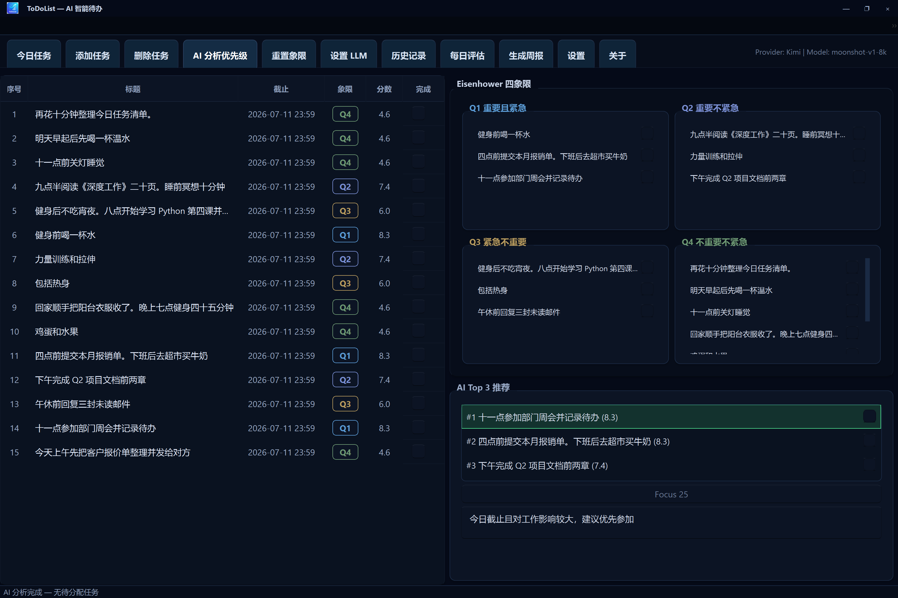
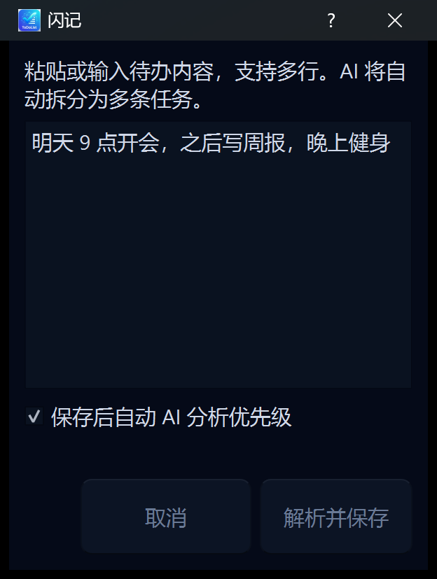
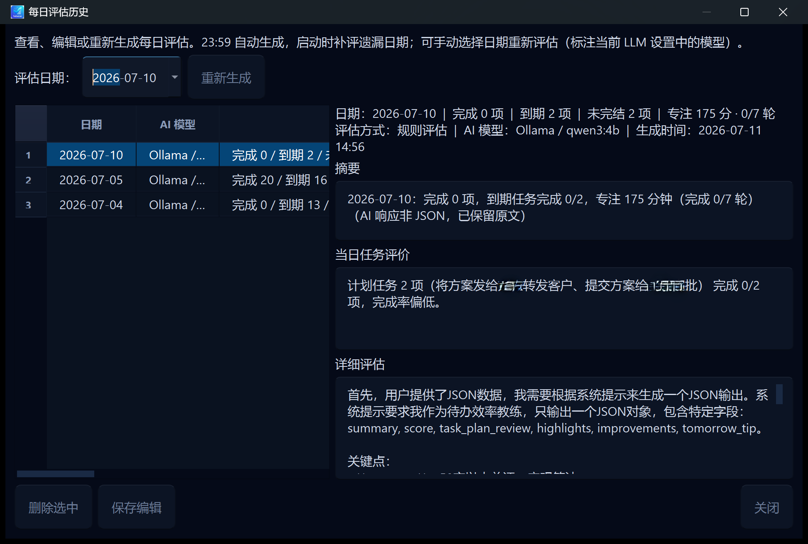
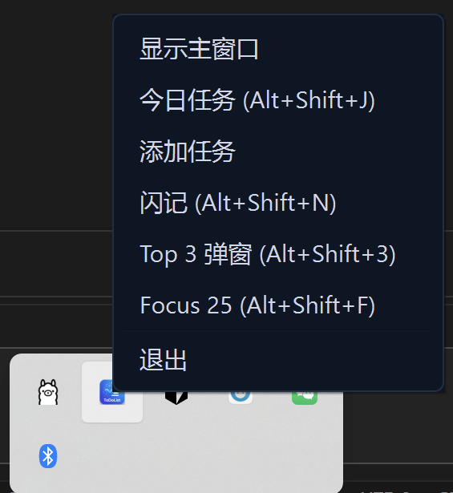
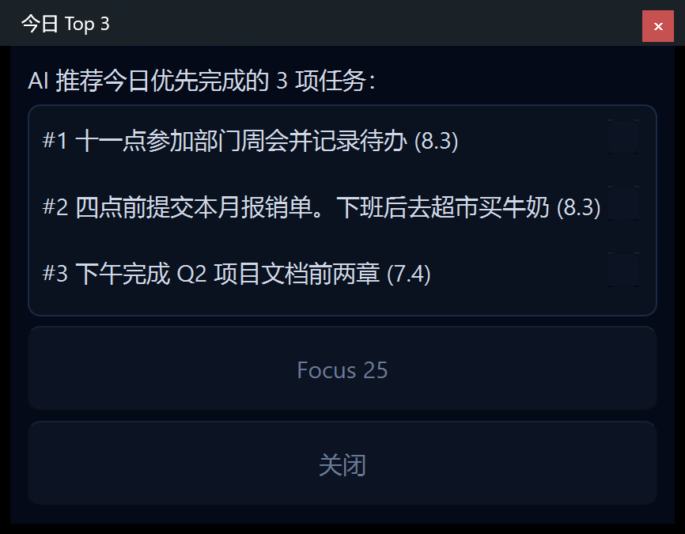
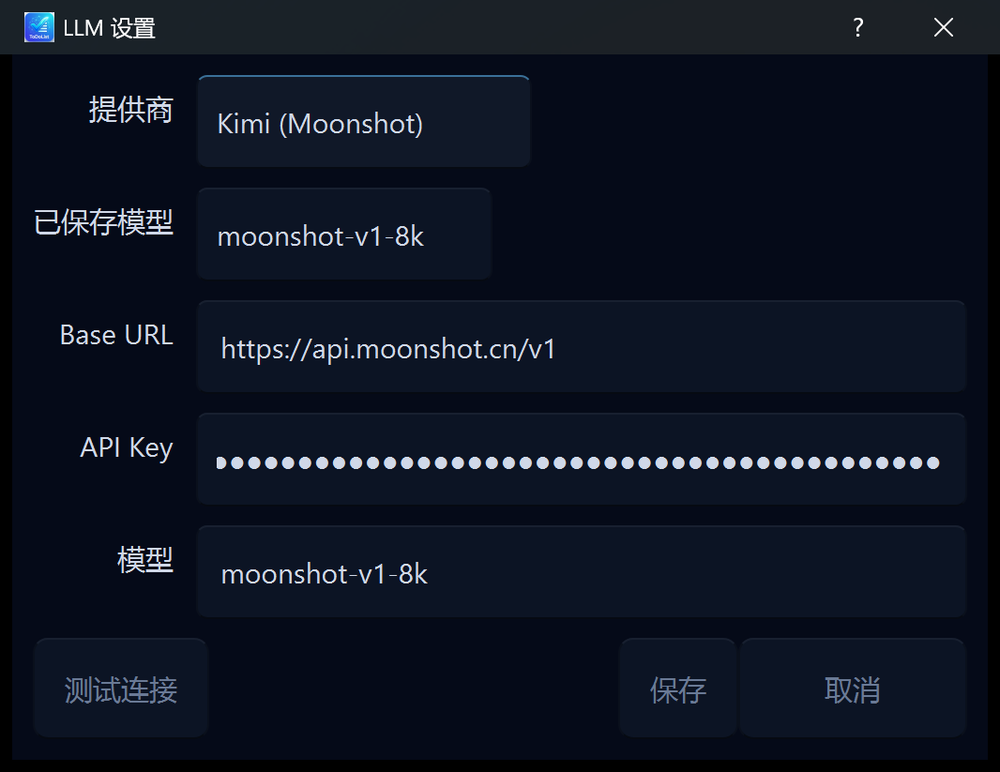
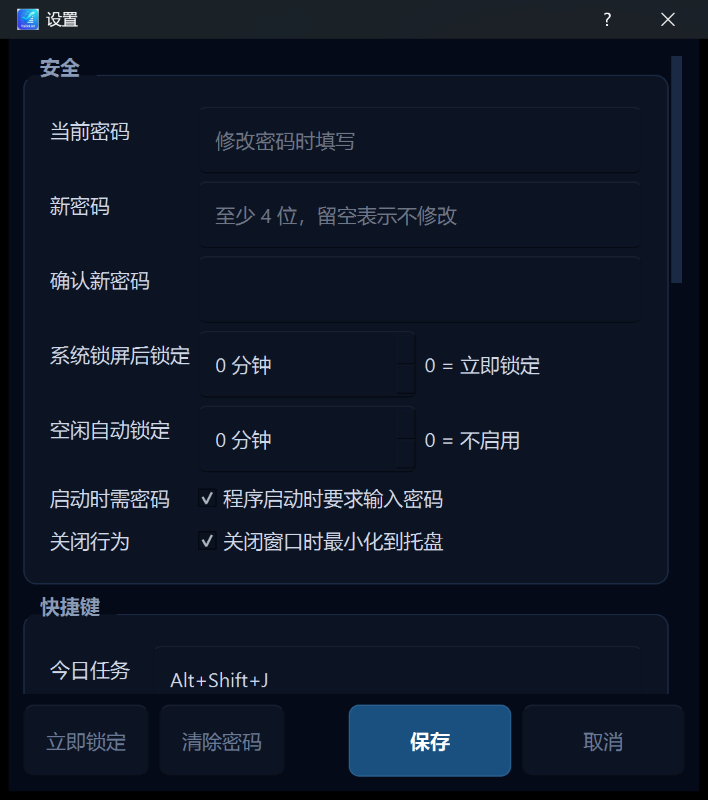
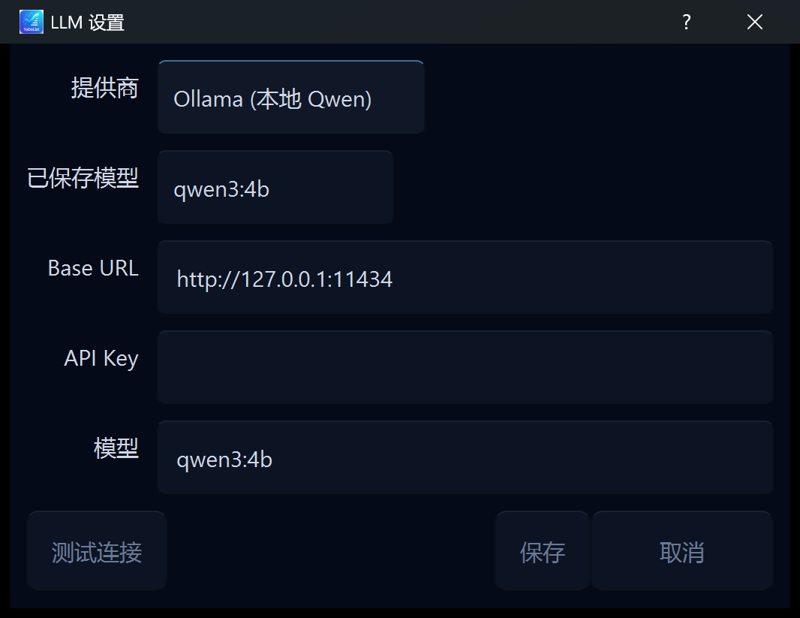
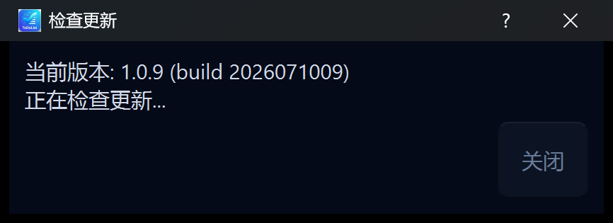

<p align="center">
  <strong>English</strong> · <a href="./README.zh-CN.md">简体中文</a>
</p>

# ToDoList — AI-Powered Smart To-Do

> **Not just another checklist app.**  
> Eisenhower Matrix × local/cloud LLMs × Top 3 decisions × Pomodoro focus — an **AI-driven workflow** built for Windows that takes you from *task overload* to *knowing your top three for today*.

<p align="center">
  
  
  
  
  <a href="https://github.com/zengxiangfu1985/ToDoList/releases"></a>
</p>

<p align="center">
  <a href="https://github.com/zengxiangfu1985/ToDoList/releases"><strong>⬇️ Download latest portable build</strong></a>
  &nbsp;·&nbsp;
  <a href="#quick-start">Quick Start</a>
  &nbsp;·&nbsp;
  <a href="#key-features">Features</a>
  &nbsp;·&nbsp;
  <a href="#llm-configuration">Configure AI</a>
</p>

<p align="center">
  
</p>

---

## How is this different from typical to-do apps?

| | Generic to-do / Notion / Todoist | **ToDoList** |
|---|:---:|:---:|
| Eisenhower Matrix board | DIY templates | ✅ **Built-in, drag & drop** |
| AI priority assignment | Rare or via plugins | ✅ **One-click analysis with reasons** |
| “What are today’s top 3?” | Self-discipline | ✅ **AI Top 3 + score ranking** |
| Natural-language capture | Usually one title per entry | ✅ **Quick Capture: one sentence → many tasks** |
| Focus + to-do integration | Separate Pomodoro app | ✅ **Focus 25 starts from Top 3** |
| Daily review | Manual journaling | ✅ **AI daily evaluation at 23:59** |
| Local LLM | Almost never | ✅ **Ollama offline — data stays on device** |
| Works when LLM is down | — | ✅ **Rule-based fallback — app keeps running** |
| Native Windows + portable | Often Electron / web | ✅ **Qt native, unzip & run, portable `data/`** |

**In one line:** Other apps help you *record* tasks. ToDoList helps you **prioritize, lock in today’s focus, execute with focus sessions, and review**.

---

## Key Features

### 🧠 AI Priority Analysis — scores *and* explains *why*

After adding tasks, click **AI Analyze Priority**. The LLM will:

- Assign tasks to **Q1–Q4 quadrants**
- Generate a **Top 3 list** with priority scores
- Attach a **readable reason** for each recommendation (click to view)

Supports **Ollama local models** (recommended: `qwen2.5:3b`) or **DeepSeek / Kimi / OpenAI-compatible APIs**. When offline or without an API key, the app **falls back to rule-based scoring** — core features keep working.



---

### 📊 Eisenhower Matrix — urgent vs. important at a glance

| Quadrant | Meaning | Action |
|----------|---------|--------|
| **Q1** Urgent & Important | Do now | Must-do today |
| **Q2** Not Urgent & Important | Schedule | Long-term value |
| **Q3** Urgent & Not Important | Delegate or quick-fix | Minimize time |
| **Q4** Not Urgent & Not Important | Defer | Consider dropping |

Drag tasks between quadrants. Completion status **syncs in real time** across the list, matrix, and Top 3.


---

### ⚡ Quick Capture — hotkey, one sentence, AI splits tasks

Press `Alt+Shift+N` for a compact floating window:

```
Team meeting at 9 tomorrow, then weekly report, gym in the evening
```

AI splits this into multiple tasks. Optionally **analyze priority right after save** — zero-friction input while walking or between meetings.



---

### 🍅 Focus 25 — start focus from Top 3

Not a standalone Pomodoro timer — tied to **today’s priorities**:

- Select a Top 3 task → `Alt+Shift+F` or click **Focus 25**
- **15 / 25 / 50 minutes** configurable
- After each session: **complete / another round / skip**
- Focus stats feed into **daily evaluation** (minutes · completed rounds)


---

### 📅 AI Daily Evaluation + Weekly Report

- **Daily evaluation**: auto-generated summary at 23:59 (completion rate + focus stats)
- **Weekly report**: select this week’s tasks, one-click AI work summary
- Missed days are backfilled on startup



---

### ⌨️ Global hotkeys + tray — work without opening the main window

| Hotkey | Action |
|--------|--------|
| `Alt+Shift+J` | Today’s tasks (batch entry) |
| `Alt+Shift+N` | Quick Capture (AI split) |
| `Alt+Shift+3` | Top 3 popup |
| `Alt+Shift+F` | Focus 25 |

Closing the main window **minimizes to tray**. Right-click the tray icon to add tasks, view Top 3, or start focus.



---

## Screenshots

| | |
|:---:|:---:|
| <br>*Portable layout* | <br>*Today’s tasks* |
| <br>*Add task* | <br>*Top 3 popup* |
| <br>*LLM settings* | <br>*Settings* |

Full screenshot index: [`docs/screenshots/README.md`](docs/screenshots/README.md).

---

## Quick Start

```text
1. Open Releases and download ToDoList-Portable-x.y.z.zip
2. Extract anywhere (desktop, USB drive, etc.)
3. Run ToDoList.exe or 启动 ToDoList.bat
4. Add tasks → configure LLM (optional) → AI Analyze Priority → check Top 3
```

**[⬇️ Go to Releases](https://github.com/zengxiangfu1985/ToDoList/releases)**


| Item | Details |
|------|---------|
| Platform | Windows 10 / 11 (64-bit) |
| Distribution | Portable — no installer |
| Data folder | `data/` next to the executable (copy the whole folder to migrate/backup) |

---

## LLM Configuration

**Entry:** toolbar → **LLM Settings**

| Provider | Use case | Default model |
|----------|----------|---------------|
| **Ollama (local)** | Offline / privacy-first | `qwen2.5:3b` |
| **DeepSeek** | Cloud API | `deepseek-chat` |
| **Kimi (Moonshot)** | Cloud API | `moonshot-v1-8k` |
| **Custom OpenAI** | Any compatible endpoint | `gpt-4o-mini` |

**Ollama in three steps:**

```bash
# 1. Install Ollama and pull a model
ollama pull qwen2.5:3b

# 2. ToDoList → LLM Settings → Provider: Ollama
#    Base URL: http://127.0.0.1:11434  Model: qwen2.5:3b  API Key: leave empty

# 3. Test connection → Save → click "AI Analyze Priority"
```




<details>
<summary><strong>Cloud API setup &amp; troubleshooting</strong></summary>

1. Create an API key on DeepSeek / Kimi / OpenAI (or compatible provider)  
2. In **LLM Settings**, pick the provider and fill Base URL, key, and model name  
3. **Test connection** → **Save**

| Symptom | What to try |
|---------|-------------|
| Connection test fails | Check key, Base URL, model name, and network |
| Cannot reach Ollama | Ensure the service is running; open `http://127.0.0.1:11434` in a browser |
| Analysis is slow | Use a smaller local model, or switch to a cloud API |
| No AI available | Rule-based Top 3 kicks in — to-do features still work |

</details>

---

## More

<details>
<summary><strong>Task management</strong></summary>

- **Single add**: title, due time, notes; quadrant manual or via AI  
- **Today’s tasks** (`Alt+Shift+J`): batch add/edit/delete; import yesterday’s unfinished items  
- **Double-click** to edit; **checkbox** completion (list / matrix / Top 3 stay in sync)  
- **History**: daily snapshots and overdue archives; double-click completion column to toggle status  

</details>

<details>
<summary><strong>Online updates</strong></summary>

**About → Check for updates**: fetches manifest, downloads zip, verifies SHA256, upgrades in place — `data/` is preserved.  
You can also **import an offline update package** (`.zip`).



</details>

<details>
<summary><strong>Privacy &amp; data</strong></summary>

**Anonymous usage telemetry** (on by default, disable in Settings): version, OS, anonymous `install_id` only — **no task content or API keys**.

| Path | Contents |
|------|----------|
| `data/tasks.db` | Tasks, focus sessions, daily evaluations |
| `data/settings.ini` | App and LLM settings |
| `data/top3-YYYY-MM-DD.json` | Daily Top 3 cache |

</details>

---

## Tech Stack

- **UI**: Qt 5.15 · C++17 · dark Cyber theme  
- **Storage**: SQLite (`data/tasks.db`)  
- **AI**: OpenAI-compatible API + Ollama; rule-based fallback  
- **Updates**: `ToDoListUpdater.exe` portable replace, user data retained  

---

## Contributing & Feedback

- 🐛 [Open an Issue](https://github.com/zengxiangfu1985/ToDoList/issues) — bugs, feature requests  
- ⭐ If ToDoList eases your “what should I do first today?” anxiety, a Star is appreciated  

---

## License

Released under the [Apache License 2.0](LICENSE).  
Third-party components (Qt, OpenSSL, etc.) follow their own licenses — see [NOTICE](NOTICE).
