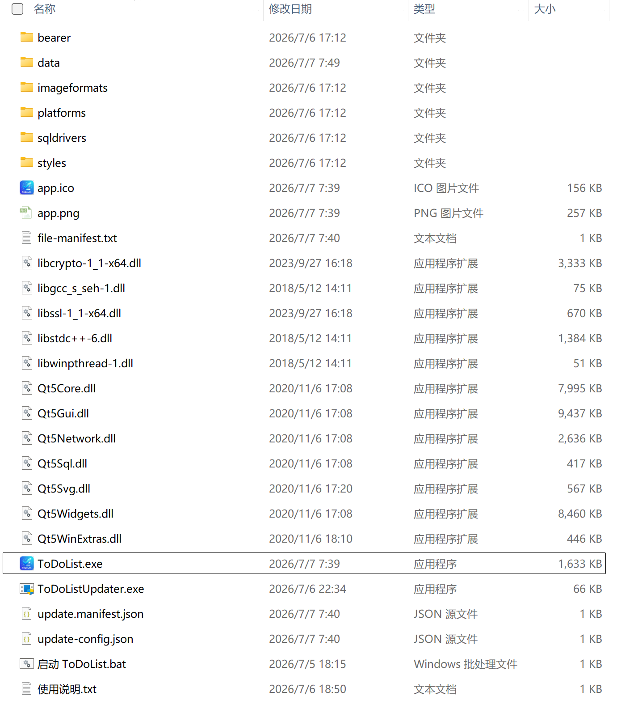
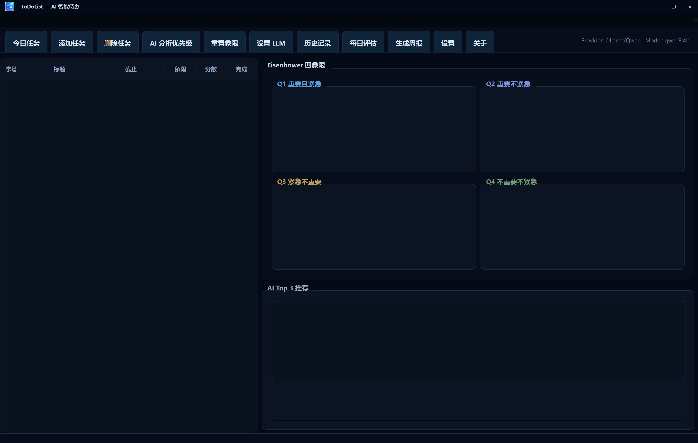
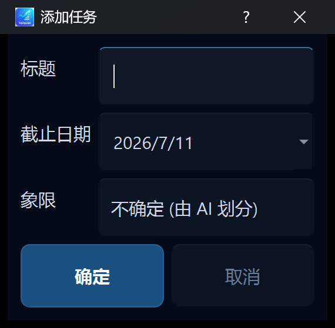
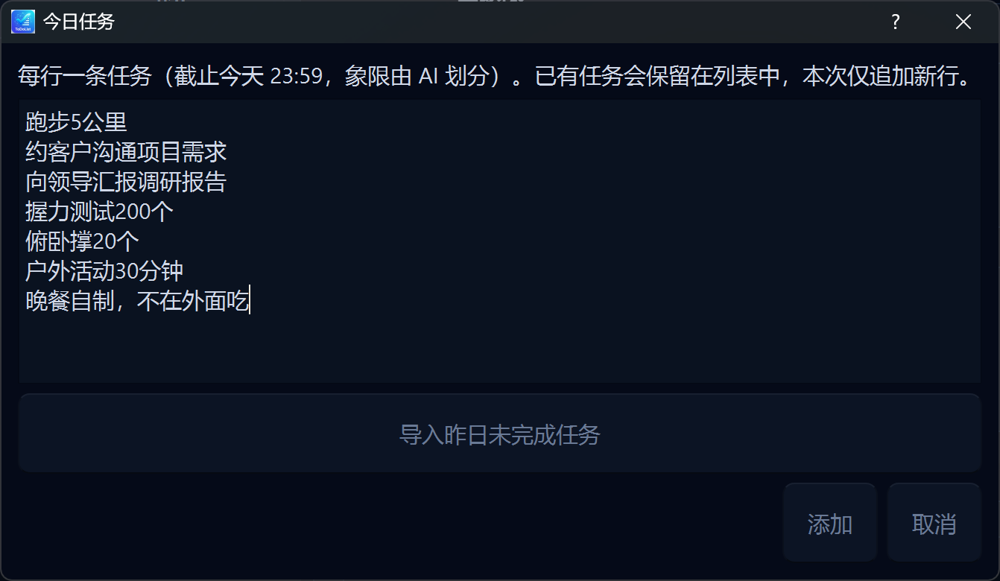

# ToDoList — AI 智能待办

基于 **艾森豪威尔四象限** 的 Windows 原生待办工具，支持本地 / 云端大模型自动划分优先级、Top 3 推荐、每日评估与便携版在线更新。

| 项目 | 说明 |
|------|------|
| 平台 | Windows 10 / 11（64 位） |
| 运行方式 | 绿色免安装便携版 |
| 技术栈 | Qt 5.15 · C++17 · SQLite |
| 数据目录 | 程序同级 `data/`（可随目录迁移） |

---

## 目录

- [快速开始](#快速开始)
- [软件使用方法](#软件使用方法)
- [模型（LLM）配置方法](#模型llm配置方法)
- [在线更新](#在线更新)
- [数据与日志](#数据与日志)
- [插图说明（如何插入截图）](#插图说明如何插入截图)

---

## 快速开始

1. 打开 [Releases](https://github.com/zengxiangfu1985/ToDoList/releases) 下载最新 `ToDoList-Portable-x.y.z.zip`。
2. 解压到任意目录（桌面、U 盘均可）。
3. 双击 **`ToDoList.exe`** 或 **`启动 ToDoList.bat`** 运行。
4. （可选）点击工具栏 **设置 LLM**，配置本地 Ollama 或云端 API。
5. 添加任务 → 点击 **AI 分析优先级** → 查看右侧 **Top 3** 推荐。

> 📷 **插图占位** [`docs/screenshots/01-quick-start.png`](docs/screenshots/01-quick-start.png)  
> 解压后的便携版目录结构（含 `ToDoList.exe`、`data/`、`使用说明.txt`）



---

## 软件使用方法

### 1. 主界面概览

主窗口分为三部分：

| 区域 | 功能 |
|------|------|
| **左侧任务列表** | 查看、编辑、勾选完成任务 |
| **右侧四象限看板** | Q1～Q4 拖拽调整、勾选完成 |
| **AI Top 3 推荐** | 显示 AI 推荐的优先任务及理由 |

工具栏常用按钮：

| 按钮 | 说明 |
|------|------|
| **今日任务** | 批量录入今日待办，可导入昨日未完成项 |
| **添加任务** | 添加单条任务 |
| **AI 分析优先级** | 调用 LLM 划分象限并生成 Top 3 |
| **设置 LLM** | 配置 AI 提供商与模型 |
| **历史记录** | 查看每日快照与过期归档 |
| **每日评估** | 查看 AI 每日完成情况 |
| **生成周报** | 勾选任务生成 AI 工作周报 |
| **设置** | 密码、锁屏、快捷键等 |
| **关于** | 版本号、检查更新、离线升级 |

> 📷 **插图占位** [`docs/screenshots/02-main-window.png`](docs/screenshots/02-main-window.png)  
> 主界面全貌：任务列表 + 四象限 + Top 3



---

### 2. 添加与管理任务

**单条添加**

1. 点击 **添加任务**。
2. 填写标题、截止时间、备注等。
3. 象限可选手动指定，也可保持「不确定」交给 AI 划分。

**批量添加（今日任务）**

1. 点击 **今日任务**（或托盘菜单 / 快捷键 `Alt+Shift+J`）。
2. 每行输入一条任务，截止时间为当天 23:59。
3. 可选择 **导入昨日未完成任务**。

**编辑与完成**

- **双击**任务行 → 编辑。
- **勾选**完成列 → 标记完成（带删除线）。
- **右键** → 删除、改象限等。
- **删除任务** 按钮 → 进入批量删除模式。

> 📷 **插图占位** [`docs/screenshots/03-add-task.png`](docs/screenshots/03-add-task.png)  
> 「添加任务」对话框



> 📷 **插图占位** [`docs/screenshots/04-today-tasks.png`](docs/screenshots/04-today-tasks.png)  
> 「今日任务」批量录入



---

### 3. 四象限与 AI 分析

**象限含义**

| 象限 | 含义 |
|------|------|
| Q1 重要且紧急 | 立即处理 |
| Q2 重要不紧急 | 计划安排 |
| Q3 紧急不重要 | 委托或快速处理 |
| Q4 不重要不紧急 | 可延后或删除 |

**AI 分析流程**

1. 先添加若干任务（象限可为「不确定」）。
2. 点击 **AI 分析优先级**。
3. 等待分析完成（界面显示「分析中请稍后」）。
4. 查看四象限自动划分结果与右侧 **Top 3** 列表。
5. 点击 Top 3 条目，下方显示 **推荐理由**。

> 📷 **插图占位** [`docs/screenshots/05-ai-analyze.png`](docs/screenshots/05-ai-analyze.png)  
> AI 分析完成后的四象限与 Top 3


> 📷 **插图占位** [`docs/screenshots/06-top3-popup.png`](docs/screenshots/06-top3-popup.png)  
> Top 3 弹窗（快捷键 `Alt+Shift+3`）


**说明**

- LLM 不可用时，程序会自动使用 **规则层评分** 生成 Top 3，基本功能仍可用。
- 当日 Top 3 会按模型自动保存，重启后可恢复。

---

### 4. 系统托盘与快捷键

关闭窗口时默认 **最小化到托盘**（可在「设置」中修改）。

| 快捷键（默认） | 功能 |
|----------------|------|
| `Alt+Shift+J` | 显示主窗口并打开「今日任务」 |
| `Alt+Shift+3` | 弹出 Top 3 小窗 |
| `Ctrl+M` | 最小化 |
| `F11` | 最大化 / 还原 |

托盘右键菜单：显示主窗口、今日任务、添加任务、Top 3 弹窗、退出。

> 📷 **插图占位** [`docs/screenshots/07-tray-menu.png`](docs/screenshots/07-tray-menu.png)  
> 系统托盘右键菜单


---

### 5. 设置与关于

**设置**（工具栏 **设置**）

- 登录密码、锁屏策略、空闲锁定
- 全局快捷键自定义
- 界面语言（中文 / English）
- Microsoft 365 邮件同步（可选）

**关于**（工具栏 **关于**）

- 查看当前 **版本号**
- **检查更新**（在线升级）
- **导入离线更新包**（`.zip`）

> 📷 **插图占位** [`docs/screenshots/08-settings.png`](docs/screenshots/08-settings.png)  
> 设置对话框


> 📷 **插图占位** [`docs/screenshots/09-about-update.png`](docs/screenshots/09-about-update.png)  
> 关于 · 检查更新


---

## 模型（LLM）配置方法

**入口：** 工具栏 → **设置 LLM**

### 支持的提供商

| 提供商 | 适用场景 | 默认 Base URL | 默认模型 |
|--------|----------|---------------|----------|
| **Ollama（本地 Qwen）** | 离线 / 本机推理 | `http://127.0.0.1:11434` | `qwen2.5:3b` |
| **DeepSeek** | 云端 API | `https://api.deepseek.com/v1` | `deepseek-chat` |
| **Kimi (Moonshot)** | 云端 API | `https://api.moonshot.cn/v1` | `moonshot-v1-8k` |
| **Custom OpenAI** | OpenAI 兼容接口 | `https://api.openai.com/v1` | `gpt-4o-mini` |

对话框字段说明：

| 字段 | 说明 |
|------|------|
| **提供商** | 选择上述四种之一 |
| **已保存模型** | 切换该提供商下曾测试成功的配置 |
| **Base URL** | API 地址 |
| **API Key** | 云端必填；Ollama 本地通常留空 |
| **模型** | 模型名称（须与平台一致） |
| **测试连接** | 验证配置；成功后加入「已保存模型」 |
| **保存** | 保存并立即切换运行时 Provider |

> 📷 **插图占位** [`docs/screenshots/10-llm-settings.png`](docs/screenshots/10-llm-settings.png)  
> LLM 设置对话框


---

### 方案 A：本地 Ollama（推荐入门）

1. 安装 [Ollama](https://ollama.com) 并确保服务已启动。
2. 在终端拉取模型，例如：
   ```bash
   ollama pull qwen2.5:3b
   ```
3. 打开 ToDoList → **设置 LLM**：
   - **提供商** 选 `Ollama (本地 Qwen)`
   - **Base URL** 保持 `http://127.0.0.1:11434`
   - **模型** 填 `qwen2.5:3b`（或您已 pull 的模型名）
   - **API Key** 留空
4. 点击 **测试连接** → 成功后 **保存**。
5. 返回主界面，点击 **AI 分析优先级** 验证。

> 📷 **插图占位** [`docs/screenshots/11-llm-ollama.png`](docs/screenshots/11-llm-ollama.png)  
> Ollama 本地配置示例（测试连接成功）


---

### 方案 B：云端 API（DeepSeek / Kimi / OpenAI 兼容）

1. 在对应平台注册并创建 **API Key**。
2. 打开 **设置 LLM**，选择对应 **提供商**。
3. 填写 **Base URL**、**API Key**、**模型名**（与平台文档一致）。
4. 点击 **测试连接** → 成功后 **保存**。

> 📷 **插图占位** [`docs/screenshots/12-llm-cloud-api.png`](docs/screenshots/12-llm-cloud-api.png)  
> 云端 API 配置示例（DeepSeek / Kimi）


**常见问题**

| 现象 | 处理建议 |
|------|----------|
| 测试连接失败 | 检查 API Key、Base URL、模型名；确认网络可访问 HTTPS |
| Ollama 连接失败 | 确认 Ollama 已启动；浏览器访问 `http://127.0.0.1:11434` 是否正常 |
| 分析很慢 | 本地模型取决于显卡/CPU；可换更小模型或改用云端 API |
| 无 AI 仍可用 | 程序会降级为规则层 Top 3，不影响基本待办功能 |

---

## 在线更新

便携版支持在线检查更新（**关于 → 检查更新**）：

1. 程序从 GitHub 拉取 `dist/update.json` 清单。
2. 发现新版本后自动下载 Release 中的 zip。
3. 校验 SHA256 通过后，点击 **立即升级**。
4. 程序退出并由 `ToDoListUpdater.exe` 替换程序文件，**`data/` 目录保留不动**。

也可在 **关于 → 导入离线更新包** 中手动选择 zip 升级。

---

## 数据与日志

| 路径 | 内容 |
|------|------|
| `data/tasks.db` | 任务数据库 |
| `data/settings.ini` | 程序设置、LLM 配置 |
| `data/logs/` | 运行日志 |
| `data/top3-YYYY-MM-DD.json` | 当日 Top 3 缓存 |

迁移备份：复制整个程序目录（含 `data/`）即可。

---

## 插图说明（如何插入截图）

本 README 预留了截图位置。按以下步骤添加插图后，GitHub 仓库首页即可显示完整图文说明。

### 1. 存放目录

将所有截图放在：

```text
docs/screenshots/
```

仓库中已预留该目录，请将 PNG 或 JPG 文件放入其中并提交到 Git。

### 2. 文件命名规范

采用 **`序号-英文简述.扩展名`**，序号与本文占位一一对应：

| 文件名 | 建议截图内容 |
|--------|--------------|
| `01-quick-start.png` | 解压后的便携版目录 |
| `02-main-window.png` | 主界面全貌 |
| `03-add-task.png` | 「添加任务」对话框 |
| `04-today-tasks.png` | 「今日任务」批量录入 |
| `05-ai-analyze.png` | AI 分析后的四象限 + Top 3 |
| `06-top3-popup.png` | Top 3 弹窗 |
| `07-tray-menu.png` | 托盘右键菜单 |
| `08-settings.png` | 设置对话框 |
| `09-about-update.png` | 关于 · 检查更新 |
| `10-llm-settings.png` | LLM 设置对话框 |
| `11-llm-ollama.png` | Ollama 本地配置（测试连接成功） |
| `12-llm-cloud-api.png` | 云端 API 配置示例 |

**命名规则**

- 使用 **小写英文 + 连字符**，不要用空格和中文文件名（避免跨平台路径问题）。
- 扩展名推荐 **`.png`**（界面截图清晰）；单张建议宽度 **1280～1600 像素**。
- 新增插图时，序号顺延，如 `13-xxx.png`，并在 README 对应章节补充引用。

### 3. 在 Markdown 中引用（本 README 已写好）

相对路径引用格式：

```markdown

```

带链接的说明行（可选）：

```markdown
> 📷 **插图占位** [`docs/screenshots/02-main-window.png`](docs/screenshots/02-main-window.png)
> 主界面全貌：任务列表 + 四象限 + Top 3


```

### 4. 上传步骤

**方式一：本地 Git**

```bash
# 1. 将截图复制到 docs/screenshots/
# 2. 提交并推送
git add docs/screenshots/
git add README.md
git commit -m "docs: add README screenshots"
git push
```

**方式二：GitHub 网页**

1. 打开仓库 → **Add file → Upload files**。
2. 将图片拖到 `docs/screenshots/` 目录（或先进入该目录再上传）。
3. 确认文件名与上表一致。
4. Commit 后 README 中的图片会自动显示。

**方式三：在 GitHub 编辑 README 时拖拽**

编辑 `README.md` 时，将图片拖入编辑框，GitHub 会自动上传到 `user-images` 或您指定的路径；建议仍统一放到 `docs/screenshots/` 以便本地与线上一致。

### 5. 截图建议

- 使用程序 **默认深色主题** 截图，风格统一。
- 敏感信息（API Key、邮箱）请打码。
- 每张图只表达一个操作步骤，避免信息过密。
- Windows 可用 `Win + Shift + S` 区域截图，保存为 PNG。

---

## 构建与开发（可选）

```bash
# 需要 Qt 5.15.2 MinGW 64-bit
qmake ToDoList.pro -spec win32-g++ CONFIG+=release
mingw32-make release

# 打包便携版
scripts\package-portable.bat
```

详细开发文档见 [`docs/`](docs/) 目录。

---

## 许可证

请参阅仓库中的 LICENSE 文件（如有）。欢迎通过 [Issues](https://github.com/zengxiangfu1985/ToDoList/issues) 反馈问题与建议。
