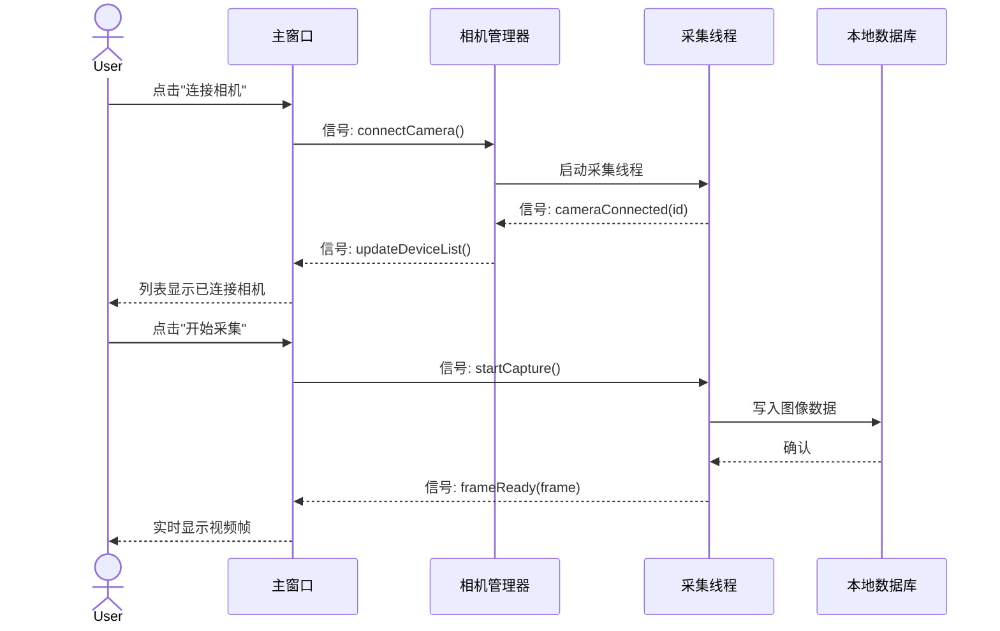

# Qt 项目规格链（Specification Chain for Qt Projects）

> **核心理念**：9 个阶段按顺序推进，每个阶段的产物都是下一个阶段的输入。AI 不再猜测，而是在每一步读取明确、结构化的上下文。这解决了 AI 编码失败最常见的原因——上下文不足。

```
需求 → 原型 → 场景 → 接口 → 数据 → 测试 → 代码 → 验收 → 变更
 01     02     03     04     05      06     07     08     09
```

---

## 为什么有效

当 AI 拿到完整规格链时，它知道：

- **要构建什么**：需求与 Qt UI 原型（Widgets / QML）
- **系统如何运转**：场景时序图（信号槽、事件循环、线程交互）
- **接口是什么**：C++ 头文件契约（类接口、信号槽、公共 API）
- **数据在哪里**：本地数据模型 / SQLite / 配置文件 Schema
- **正确如何定义**：Qt Test 用例与验收结果

---

## Phase 01 · 需求分析

需求阶段通过结构化对话生成 `requirements.md`。这份文档是项目的**需求真源**，记录软件要解决什么问题、服务哪些用户，以及怎样判断结果是正确的。

### 产物内容

`docs/prd/1-product-requirements/requirements.md` 通常包含：

- **用户画像**：谁会使用产品，以及为什么使用
- **痛点分析**：用户当前遇到的问题
- **场景 ID**：S01、S02、S03 等，每个 ID 对应一条用户旅程
- **验收标准**：每个场景至少有一条可验证条件

### 如何运行

1. 打开项目，进入 Phase 1 → Requirements。
2. 按提示回答结构化问题：
   - 你想构建什么？
   - 用户是谁？
   - 主要场景有哪些？
   - 每个场景怎样才算完成？
3. 对话结束后，写入 `requirements.md`。

### 编写建议

- 用户画像要具体。不要只写"操作员"，应描述真实角色，例如"现场工程师，需要在无网络环境下使用笔记本进行视觉测量数据采集"。
- 每个场景应是一条**完整用户旅程**，而不是功能清单。
- 验收标准必须**可观察**，例如"用户点击'开始采集'按钮后，10 秒内显示实时视频流，且帧率不低于 25fps"。

### 输出示例

```markdown
## 用户画像

- **张工**：现场视觉测量工程师，需要在工业现场使用笔记本进行多路相机数据采集……

## 场景

### S01 — 设备连接与初始化
用户启动软件，自动发现局域网内的海康相机并完成连接。

#### 验收标准
- AC-S01-1：软件启动后 5 秒内完成相机枚举。
- AC-S01-2：双击相机列表项后，3 秒内显示实时预览画面。
```

**下一步** → Phase 02 · 产品设计

---

## Phase 02 · 产品设计

产品设计阶段把需求文档转成用户可感知的界面和交互。设计阶段会读取 `requirements.md`，生成产品功能规格，并产出**可预览的 Qt UI 原型**。

### 产物内容

`docs/prd/2-product-design/` 通常包含：

- **功能规格文档**：描述窗口、控件、布局、交互和状态（基于 Qt Widgets 或 QML）
- **UI 原型文件**：`.ui` 文件（Qt Designer）或 `.qml` 文件，用于直观看到关键界面
- **页面级验收标准**：约束后续场景和实现

### 如何运行

1. 进入 Phase 2 → Product Design。
2. 将需求文档交给设计阶段。
3. 生成原型后，在 Qt Designer 或 QML Live Preview 中预览。

### 如何迭代

如果原型不符合预期，可以直接在规格或 `.ui`/`.qml` 文件中添加注释，再次运行设计阶段。AI 会读取这些反馈并更新设计产物。

### 为什么重要

原型是**视觉契约**。后续场景、接口、测试和代码都应该围绕这个契约展开。如果原型改变，下游规格也应同步更新。

**Qt 特有注意事项**：
- 明确使用 **Qt Widgets** 还是 **QML** 技术路线
- 标注关键控件的信号（如 `QPushButton::clicked`、`QComboBox::currentIndexChanged`）
- 定义窗口间的模态/非模态关系（`QDialog`、`QMainWindow`）

**下一步** → Phase 03 · 场景建模

---

## Phase 03 · 场景建模

场景阶段会读取产品原型和功能规格，为每个场景 ID 生成**时序图**。时序图描述哪个角色在什么顺序下触发哪个 Qt 对象的能力，以及有哪些边界情况。

### 产物内容

`docs/prd/3-technical-plan/2-scenario-implementation/` 中会生成场景实现文档，例如：

- **`scenario-overview.md`**（推荐）：场景索引、参与方别名、跨场景信号总线
- **`S01-device-connect.md`**
- **`S02-image-capture.md`**
- **`S03-data-export.md`**

同目录上级 **`docs/prd/3-technical-plan/1-architecture/`** 为可扩展槽位，用于模块分层、线程模型与 NFR（与 Phase 04 接口设计衔接；详见附录目录树）。

### 示例（Qt 信号槽时序图）



### 为什么先有场景再设计接口

场景图迫使团队先看完整交互，而不是孤立设计类接口。时序图中的每个边界情况会进入测试设计，每个信号/槽调用会进入 C++ 接口契约。

跳过这一步，接口很容易偏离真实用户流程。

**Qt 特有关注点**：
- 明确**信号（Signal）**与**槽（Slot）**的流向
- 标注**线程上下文**（主线程 vs QThread）
- 识别**事件循环**中的阻塞点
- 处理**跨对象生命周期**问题（如相机断开时的对象析构）

**下一步** → Phase 04 · 接口设计

---

## Phase 04 · 接口设计

接口设计阶段会读取场景时序图并生成**C++ 头文件契约**。每个公共接口都应追溯到某个场景步骤，避免 AI 临场发明接口。

### 产物内容

`docs/api/` 中会包含 C++ 头文件（`.h`）和接口说明文档，通常覆盖：

- **类定义**：公共方法、信号、槽、属性（Q_PROPERTY）
- **请求/响应结构**：参数结构体、枚举类型、返回码
- **线程安全约定**：哪些接口线程安全、哪些必须在主线程调用
- **统一错误处理机制**：错误码枚举、异常策略

### 可追溯性

规格中的接口应能追溯到场景步骤：

```cpp
// Scenario: S01 Step 2
class CameraManager : public QObject {
    Q_OBJECT
public:
    explicit CameraManager(QObject *parent = nullptr);

    // 连接指定相机，返回是否成功
    bool connectCamera(const QString &deviceId, QString *errorMsg = nullptr);

    // 断开所有相机连接
    void disconnectAll();

    // 获取已连接相机列表
    QList<CameraInfo> connectedCameras() const;

signals:
    // 相机连接状态变更（Scenario: S01 Step 3）
    void cameraStatusChanged(const QString &deviceId, CameraStatus status);

    // 新帧就绪（Scenario: S02 Step 4）
    void frameReady(const QString &deviceId, const QImage &frame);

private:
    QScopedPointer<CameraManagerPrivate> d;
};
```

### 在项目中查看

使用 Qt Creator 或 VS Code 查看头文件，审查接口是否完整：
- 公共 API 是否覆盖了所有场景步骤？
- 信号/槽参数是否满足数据传递需求？
- 是否遗漏了错误处理分支？

**Qt 特有注意事项**：
- 优先使用 Qt 类型（`QString`、`QList`、`QImage`）而非 STL，确保信号槽兼容性
- 明确标注 `Q_INVOKABLE`、`Q_PROPERTY`、`Q_SIGNALS`、`Q_SLOTS`
- 定义 PIMPL 模式（`d`指针）保持二进制兼容性
- 考虑 Qt 元对象系统（MOC）对模板和多重继承的限制

**下一步** → Phase 05 · 数据设计

---

## Phase 05 · 数据设计

数据设计阶段从接口契约中推导数据模型。会识别请求和响应中涉及的实体，并生成适合 Qt 项目的数据存储方案。

### 产物内容

`docs/database/` 通常包含：

- **schema.sql**：SQLite 数据库的 DDL（Qt 项目常用本地数据库）
- **data-model.md**：实体映射、Model 规格、QSettings 键、线程策略
- **数据模型类**：继承 `QAbstractTableModel` / `QAbstractItemModel` 的 C++ 类（规格写在 data-model.md）
- **配置文件 Schema**：`QSettings` 键值规范；JSON 可另存 `*.schema.json`
- **增量 DDL**：`migration_*.sql`，用于迭代中的结构变更
- **`samples/`**（可扩展）：测试与算法对齐用的最小样例文件

> 混合存储（SQLite + JSON 轨迹/标定等）时，将格式说明 md 与 Schema 一并放在 `docs/database/`，并登记到 `qt-project.yaml` 的 `resource_index`。

### 可视化表编辑

使用 Qt Creator 的 SQL 编辑器或 DB Browser for SQLite：

- 新增或重命名字段
- 设置数据类型、默认值、非空和唯一约束
- 定义索引和外键关系
- 导出更新后的 DDL

### 数据存储选型

| 存储方案 | 说明 | 适用场景 |
|---------|------|---------|
| **SQLite** | Qt 内置支持（`QSqlDatabase`），零配置 | 本地数据持久化、中小型项目 |
| **QSettings** | 注册表/INI 文件，键值存储 | 用户偏好设置、窗口状态 |
| **JSON/QJsonDocument** | 结构化配置文件 | 设备参数、标定数据 |
| **二进制文件** | `QDataStream` 序列化 | 图像缓存、大数据块 |

**Qt 特有注意事项**：
- 模型/视图架构：数据模型类必须遵循 `QAbstractItemModel` 接口规范
- 数据库线程：SQLite 操作应在独立线程执行，通过信号槽回传结果
- 数据变更通知：模型数据变更必须发射 `dataChanged()`、`rowsInserted()` 等信号
- 配置持久化：`QSettings` 的键名应统一规范，避免分散在代码各处

**下一步** → Phase 06 · 测试设计

---

## Phase 06 · 测试设计

测试设计阶段在代码之前定义"正确"。测试阶段会读取场景时序图，为每个场景生成**Qt Test 用例**。

### 产物内容

`docs/test/` 中会生成测试用例文档：

- **`test-overview.md`**（推荐）：跨场景总览——UT/ST/GT ID 规范、AC 追溯表、EX 矩阵、Fixtures 约定；多场景项目几乎必备
- **`S01-test-cases.md`**、**`S02-test-cases.md`** …：按场景 ID 拆分的用例明细

每个用例都有稳定 ID，例如 `UT-S01-01`、`ST-S01-03`、`GT-S01-01`（GUI 测试）。这些 ID 会从测试文档延续到测试代码和验收报告（Phase 08 的 `docs/verify/`）。

> **与 `qt-project.yaml` 对齐**：将 `docs/test/test-overview.md` 及各 `Sxx-test-cases.md` 登记到根目录 `resource_index`，便于 AI 按路径加载上下文。

### 用例格式

```markdown
## UT-S01-01 — 使用有效设备 ID 连接相机

**类型**：Unit（单元测试）
**来源**：S01 Step 2
**输入**：`CameraManager::connectCamera("CAM_001")`
**预期**：返回 `true`，并发射 `cameraStatusChanged("CAM_001", Connected)` 信号
**边界情况**：重复连接返回 `false`，错误信息为"设备已连接"

## GT-S01-01 — 点击连接按钮后列表更新

**类型**：GUI Test（Qt Test GUI）
**来源**：S01 Step 3
**输入**：模拟点击"连接相机"按钮，选择设备 ID
**预期**：5 秒内 `QListView` 中出现新条目，状态列显示"已连接"
**边界情况**：无可用设备时，按钮应置灰（`setEnabled(false)`）
```

### 为什么在代码之前

先写测试规格可以暴露设计缺口，例如：
- 缺少异常分支（相机断开、权限不足）
- 验收标准不清晰（"快速响应"→具体毫秒数）
- 信号/槽参数未定义（帧率数据如何传递？）

到代码生成阶段，AI 会明确知道哪些行为必须被实现和验证。

**Qt 特有测试类型**：

| 测试类型 | 工具/框架 | 用途 |
|---------|----------|------|
| **单元测试** | `QTestLib` | 测试独立类、算法、工具函数 |
| **GUI 测试** | `Qt Test` + `QTest::mouseClick` | 模拟用户交互，验证界面响应 |
| **信号测试** | `QSignalSpy` | 验证信号发射时机、参数正确性 |
| **基准测试** | `QBENCHMARK` | 测试图像处理、算法性能 |
| **集成测试** | 自定义测试应用 | 验证多模块协作（相机+采集+存储） |

**下一步** → Phase 07 · 代码生成

---

## Phase 07 · 代码生成

代码生成阶段是规格链开始兑现价值的地方。AI 会读取需求、原型、场景、接口、数据 Schema 和测试用例，并按这些契约生成 **C++/Qt 业务代码**。

### 输入内容

代码生成阶段通常会读取：

| 文件 | 作用 |
|------|------|
| `requirements.md` | 要构建什么，以及为什么 |
| 产品设计文档和 `.ui`/`.qml` 原型 | 用户界面与交互契约 |
| 场景实现文档 | 调用顺序和边界情况 |
| C++ 头文件契约（`.h`） | 精确接口定义 |
| 数据库 DDL / 数据模型类 | 数据模型 |
| 测试用例文档 | 正确性的定义 |

### 输出内容

代码实现必须同时包含：

- **业务代码**：`.cpp` / `.h` / `.ui` / `.qml` / `.pro` 或 `CMakeLists.txt`
- **与测试用例 ID 对齐的测试代码**：基于 `QTestLib` 的单元测试、GUI 测试
- **构建系统**：`CMakeLists.txt` 或 `.pro` 文件，确保可编译
- **测试报告**：`test-results.xml`（Qt Test 默认输出）或自定义 JSONL reporter

大任务可以分批，但每批必须闭环，不能把测试推迟到最后统一补。

### 推荐提示词

> 请按 Phase 3 Step 4 执行本次实现。
> 若任务较大可分批，但每批必须同时交付业务代码、对应 UT/ST/GT 测试代码和构建配置。
> 输出代码前请先列出本批覆盖的 UT/ST/GT 用例 ID。

### Qt 代码生成规范

- **目录结构**：按模块组织（`src/core/`、`src/ui/`、`src/models/`、`tests/`）
- **命名规范**：类名 `PascalCase`，文件匹配类名，信号槽使用 `on_对象名_信号名` 或自定义槽名
- **内存管理**：优先使用 `QObject` 父子树、`QScopedPointer`、`QSharedPointer`
- **线程安全**：耗时操作放入 `QThread` 或 `QtConcurrent`，禁止在主线程阻塞
- **资源文件**：图标、QSS 样式表放入 `.qrc` 资源文件
- **国际化**：所有用户可见字符串使用 `tr()` 包裹，提取 `.ts` 文件

**下一步** → Phase 08 · 验收验证

---

## Phase 08 · 验收验证

验收阶段会读取测试输出（`docs/verify/test-results.xml` 或自定义 reporter），并把测试结果与需求、测试用例文档交叉匹配，生成**可追溯验收报告**（`docs/verify/acceptance-report.md`）。

### 产物内容

| 文件 | 用途 |
|------|------|
| `docs/verify/test-results.xml` | Qt Test `-xml` 输出；用例名须与 `docs/test/` 中 ID 一致 |
| `docs/verify/acceptance-report.md` | AC 追溯矩阵、Gate 结论（PASS / CONDITIONAL PASS / FAIL）、缺口清单 |

建议在根目录 `qt-project.yaml` 中固定路径，与代码生成工具共享同一约定：

```yaml
verify:
  result_path: docs/verify/test-results.xml
  acceptance_report: docs/verify/acceptance-report.md
```

### 前置要求

- 测试代码必须使用 Qt Test 框架或兼容的 reporter。
- `test-results.xml` / `test-results.jsonl` 必须包含测试用例结果。
- 测试结果中的 ID 必须与 `docs/test/` 中定义的 ID 完全一致。

### 运行命令

```bash
# CMake 项目
mkdir build && cd build
cmake .. && make
ctest --output-on-failure
./tests/test_app -xml -o ../docs/verify/test-results.xml

# qmake 项目（示例）
qmake CONFIG+=release && nmake    # 或 mingw32-make
./build/bin/release/tst_* -xml -o docs/verify/test-results.xml
```

验收报告由人工或 AI 读取 `test-results.xml` 与 `docs/test/test-overview.md` 后写入 `acceptance-report.md`。

### 输出内容

验收报告会展示：

- 总需求数
- 已覆盖需求数
- 未覆盖需求和失败用例
- 测试通过率（单元测试 / GUI测试 / 集成测试）
- **Gate 结论**：PASS 或 FAIL

### 如何解读

- **PASS**：每条验收标准都有对应通过测试。
- **FAIL**：列出缺口和失败用例，便于回到规格或代码修复。

**Qt 特有验收项**：
- 内存泄漏检测（使用 `valgrind` 或 Qt 内置泄漏检测）
- 跨平台编译验证（Windows / Linux / macOS）
- UI 响应性能（界面冻结超过 100ms 视为失败）
- 高 DPI 适配验证

**下一步** → 运行迭代管理，或阅读变更提案了解上线后的修改流程。

---

## Phase 09 · 变更提案

项目上线后，每次功能变更或 Bug 修复都应从 **Delta 提案**开始。提案说明变更原因、影响范围和需要同步更新的规格产物。

### 为什么不能直接改代码

直接改代码会让规格漂移。过一段时间后，接口文档、测试用例和真实实现可能互相矛盾，规格链也就失去可追溯性。

变更提案强制执行：**先规格，后代码**。

### 创建提案

```bash
cd my-project
# 创建变更目录
mkdir -p docs/changes/add-thermal-compensation
```

在 `docs/changes/add-thermal-compensation/proposal.md` 中写入提案模板：

```markdown
# 变更提案：add-thermal-compensation

## 变更原因
用户反馈温度补偿功能缺失，导致高温环境下测量精度下降。

## 影响范围
- **需求文档**：新增 S04 — 温度补偿场景
- **UI 原型**：主界面新增"温度补偿"开关（`.ui` 文件修改）
- **接口**：`MeasurementEngine` 新增 `setTemperature(double)` 方法
- **数据模型**：`measurements` 表新增 `temperature` 字段（增量 DDL）
- **测试用例**：新增 UT-S04-01、GT-S04-01
- **代码**：`src/core/measurementengine.cpp`

## 回滚策略
若补偿算法引入回归误差，可通过 `QSettings` 开关禁用该功能。
```

### 合并提案

当 delta 文件完成并经过确认后：

1. 按更新后的规格修改所有上游文档（需求、原型、场景、接口、数据）
2. 实现代码、运行测试
3. 验收通过后归档，将提案标记为 `MERGED`

### Qt 特有变更风险

| 变更类型 | 风险点 | 缓解措施 |
|---------|--------|---------|
| 修改信号/槽签名 | 破坏既有连接，运行时静默失败 | 同步更新所有 `connect()` 调用，编译期检查 |
| 修改 `Q_PROPERTY` | QML 绑定失效 | 更新 QML 文件中的属性引用 |
| 修改数据库 Schema | 旧版本数据不兼容 | 提供 `QSqlQuery` 迁移脚本 |
| 修改 `.ui` 文件 | 代码中查找的控件名失效 | 同步更新 `ui->xxx` 引用 |
| 新增第三方库 | 部署依赖增加 | 更新 `CMakeLists.txt` / `.pro`，验证静态/动态链接 |

---

## 附录：Qt 规格链目录结构建议

> **定位**：以下为 **最小模板 + 可扩展槽位**，不是与本仓库 1:1 的强制结构。  
> 小项目可只保留「必选」条目；规模变大时再启用 `[可扩展]` 槽位。  
> 完整资源清单与验收路径建议写入根目录 **`qt-project.yaml`** 的 `resource_index` / `verify` 段（见文末对照说明）。

### 目录树（最小模板）

```
my-qt-project/
├── qt-project.yaml                 # [可扩展] 资源索引 + verify 路径约定
├── my-qt-project.pro               # 或 CMakeLists.txt；大项目可用 subdirs（app/ + tests/）
├── README.md
│
├── docs/
│   ├── Qt项目规格链.md              # [可扩展] 方法论（本文件）
│   │
│   ├── prd/
│   │   ├── 1-product-requirements/     # Phase 01
│   │   │   └── requirements.md
│   │   ├── 2-product-design/         # Phase 02
│   │   │   ├── design-spec.md
│   │   │   └── prototypes/           # 规格 UI：Designer 预览、objectName 契约
│   │   │       ├── mainwindow.ui
│   │   │       └── capturepanel.qml    # Widgets / QML 择一或分模块混用
│   │   └── 3-technical-plan/
│   │       ├── 1-architecture/         # [可扩展] 模块分层、线程、NFR（Phase 04 前置）
│   │       │   └── architecture-overview.md
│   │       └── 2-scenario-implementation/   # Phase 03
│   │           ├── scenario-overview.md     # [可扩展] 场景索引与信号总线
│   │           ├── S01-device-connect.md
│   │           └── S02-image-capture.md
│   │
│   ├── api/                            # Phase 04
│   │   ├── api-spec.md
│   │   ├── camera_manager.h
│   │   └── measurement_engine.h
│   │
│   ├── database/                       # Phase 05
│   │   ├── schema.sql
│   │   ├── migration_v1_to_v2.sql
│   │   ├── data-model.md
│   │   ├── *.schema.json               # [可扩展] JSON / 标定 / 轨迹 Schema
│   │   └── samples/                    # [可扩展] 对齐与测试用样例
│   │
│   ├── test/                           # Phase 06
│   │   ├── test-overview.md            # 总览：ID 规范、AC/EX、Fixtures
│   │   ├── S01-test-cases.md
│   │   └── S02-test-cases.md
│   │
│   ├── verify/                         # Phase 08（验收闭环，非可选）
│   │   ├── acceptance-report.md
│   │   └── test-results.xml            # Qt Test -xml 输出（可 git 跟踪或 .gitignore）
│   │
│   └── changes/                        # Phase 09
│       └── add-thermal-compensation/
│           └── proposal.md
│
├── src/                                # Phase 07
│   ├── core/
│   ├── ui/
│   ├── models/
│   └── utils/                          # 或 io/、types/ 等按领域命名
│
├── tests/
│   ├── tst_*.cpp                       # 最小：单文件 Qt Test
│   ├── unit/                           # [可扩展]
│   ├── gui/                            # [可扩展]
│   ├── integration/                    # [可扩展]
│   └── fixtures/                       # [可扩展] 测试数据
│
├── resources/                          # 编译进 .qrc 的运行时资源
│   ├── ui/                             # [可扩展] 合并后的 .ui（与 prototypes/ 分工见下）
│   ├── images/
│   └── styles/
│       └── app.qss
│
├── app/                                # [可扩展] subdirs 应用入口 .pro
└── common/                             # [可扩展] 共享 .pri（如 MSVC /utf-8）
```

### 槽位说明

| 标记 | 含义 |
|------|------|
| （无标记） | 最小模板建议具备，保证 9 阶段可追溯 |
| `[可扩展]` | 按项目规模启用；未启用不影响规格链完整性 |
| **Phase 08 `verify/`** | 验收产物目录；与 Phase 06 的 `test-overview.md` 配对使用 |

**UI 双轨约定**（避免规格与构建漂移）：

| 位置 | 角色 |
|------|------|
| `docs/prd/2-product-design/prototypes/` | **规格原型**：设计评审、objectName 契约 |
| `resources/ui/` | **运行时 UI**：写入 `.qrc`、参与编译；Phase 07 合并或同步自原型 |
| `resources/styles/` | QSS 主题；Phase 09 变更常改此处 |

**目录编号 ≠ Phase 编号**：例如 `prd/3-technical-plan/1-architecture` 是 PRD 子目录序号，对应 Phase 04 架构产物；`2-scenario-implementation` 对应 Phase 03 场景产物。以各 Phase 章节为准，勿机械等同。

---

## 附录 B：与本项目 BadmintonLineJudge 的对照说明

本仓库是上述模板的**参考实例**，不是附录树的超集强制清单。差异如下，供复制模板时取舍：

### 与最小模板的对应关系

| 模板槽位 | BadmintonLineJudge 实际 | 备注 |
|---------|------------------------|------|
| `qt-project.yaml` | ✅ 根目录 | `resource_index` 列出 40+ 规格路径；`verify` 固定验收输出 |
| `docs/prd/…/prototypes/` | ✅ 3 个 `.ui` | `main-judge-workspace.ui` 等 |
| `resources/ui/` | ✅ 合并后 `.ui` | 与 prototypes 分工，编译进 `resources.qrc` |
| `1-architecture/` | ✅ `architecture-overview.md` | 模块分层 ui/core/io/models/types |
| `scenario-overview.md` | ✅ | S01–S08 场景地图 |
| `docs/database/samples/` + `*.schema.json` | ✅ | 轨迹/标定 JSON；另有 `trajectory-format.md` |
| `docs/test/test-overview.md` | ✅ | AC/EX/Fixtures 总览 |
| `docs/verify/` | ✅ | `acceptance-report.md` + `test-results.xml` |
| `docs/changes/` | ✅ | 如 `ui-dark-theme-background/proposal.md` |
| 领域补充文档 | ✅ `docs/羽毛球AI司线员辅助系统_Demo开发要点.md` | 非通用模板项，登记在 `resource_index` |

### 有意扩展、非人人需要的部分

| 项 | 本项目做法 | 模板默认 |
|----|-----------|---------|
| 场景数量 | S01–S08（8 个 md + 8 个 test md） | 示例仅 S01/S02 |
| `src/` 分层 | `core/` `ui/` `models/` **`io/`** **`types/`** | 示例为 `utils/` |
| 构建 | `BadmintonLineJudge.pro` subdirs → `app/` + `tests/` | 单根 `.pro` |
| 测试代码 | `tests/tst_blj_unit.cpp` 单目标 | 可选 `unit/gui/integration/` 子目录 |
| 工具链 | `common/msvc_utf8.pri` | 按需添加 |

### `qt-project.yaml` 对齐要点

启动 AI 或自动化验收前，优先读取：

1. **`resource_index`** — 各 Phase 产物路径与一句话说明（与 `docs/` 树一致即可，不必与附录示例文件名相同）
2. **`verify.result_path`** — 测试 XML 写入位置（本项目：`docs/verify/test-results.xml`）
3. **`verify.acceptance_report`** — Gate 报告位置（本项目：`docs/verify/acceptance-report.md`）

```yaml
# BadmintonLineJudge 片段（完整见仓库根目录 qt-project.yaml）
verify:
  result_path: docs/verify/test-results.xml
  acceptance_report: docs/verify/acceptance-report.md
```

新增规格文件时：**先落盘到 `docs/`，再追加 `resource_index` 条目**，保持「路径真源 = 文件系统 + yaml 索引」一致。

---

*本文档遵循"先规格，后代码"原则，确保 Qt 项目从需求到交付的全程可追溯。*
