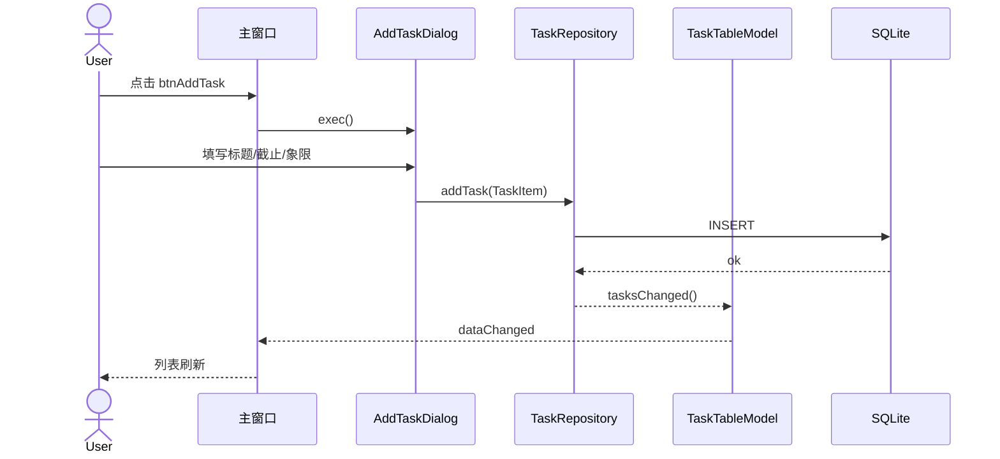

# S01 — 任务创建与 Eisenhower 四象限管理

```mermaid
sequenceDiagram
  actor User
  participant MainWindow as 主窗口
  participant Dialog as AddTaskDialog
  participant Repo as TaskRepository
  participant Model as TaskTableModel
  participant DB as SQLite

  User->>MainWindow: 点击 btnAddTask
  MainWindow->>Dialog: exec()
  User->>Dialog: 填写标题/截止/象限
  Dialog->>Repo: addTask(TaskItem)
  Repo->>DB: INSERT
  DB-->>Repo: ok
  Repo-->>Model: tasksChanged()
  Model-->>MainWindow: dataChanged
  MainWindow-->>User: 列表刷新
```

## EX-S01-1 空标题

Dialog 校验失败，不调用 `addTask`，显示警告。
