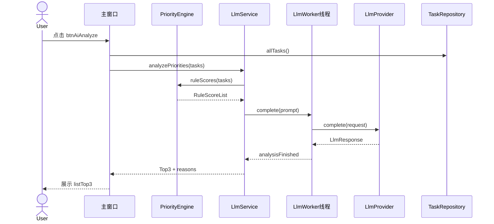

# S02 — AI 动态优先级与 Top 3

```mermaid
sequenceDiagram
  actor User
  participant MainWindow as 主窗口
  participant Engine as PriorityEngine
  participant Service as LlmService
  participant Worker as LlmWorker线程
  participant Provider as LlmProvider
  participant Repo as TaskRepository

  User->>MainWindow: 点击 btnAiAnalyze
  MainWindow->>Repo: allTasks()
  MainWindow->>Service: analyzePriorities(tasks)
  Service->>Engine: ruleScores(tasks)
  Engine-->>Service: RuleScoreList
  Service->>Worker: complete(prompt)
  Worker->>Provider: complete(request)
  Provider-->>Worker: LlmResponse
  Worker-->>Service: analysisFinished
  Service-->>MainWindow: Top3 + reasons
  MainWindow-->>User: 展示 listTop3
```

## EX-S02-1 Ollama 不可用

Provider 返回错误 → Service 发射 `analysisFinished` 含 `usedLlm=false`，MainWindow 展示规则层 Top 3 + 警告。
