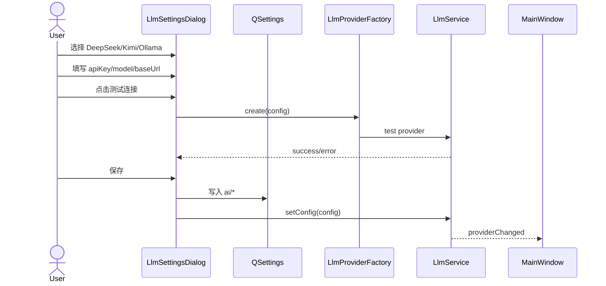

# S03 — LLM Provider 配置与切换

## Provider 预设

| 类型 | 默认 Base URL | 默认 Model |
|------|---------------|------------|
| Ollama | http://127.0.0.1:11434 | qwen2.5:3b |
| DeepSeek | https://api.deepseek.com/v1 | deepseek-chat |
| Kimi | https://api.moonshot.cn/v1 | moonshot-v1-8k |
