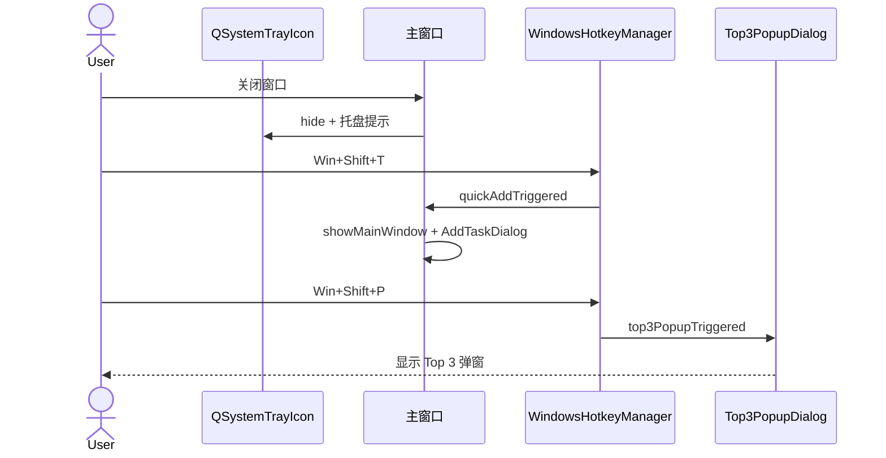

# S04 — 系统托盘与全局快捷键

```mermaid
sequenceDiagram
  actor User
  participant Tray as QSystemTrayIcon
  participant MainWindow as 主窗口
  participant Hotkey as WindowsHotkeyManager
  participant Popup as Top3PopupDialog

  User->>MainWindow: 关闭窗口
  MainWindow->>Tray: hide + 托盘提示
  User->>Hotkey: Win+Shift+T
  Hotkey->>MainWindow: quickAddTriggered
  MainWindow->>MainWindow: showMainWindow + AddTaskDialog
  User->>Hotkey: Win+Shift+P
  Hotkey->>Popup: top3PopupTriggered
  Popup-->>User: 显示 Top 3 弹窗
```

## 验收标准

- AC-S04-1：关闭主窗口后应用不退出，托盘图标可见。
- AC-S04-2：`Win+Shift+T` 唤起快速添加对话框。
- AC-S04-3：`Win+Shift+P` 弹出 Top 3 窗口（无 AI 结果时用规则层）。
